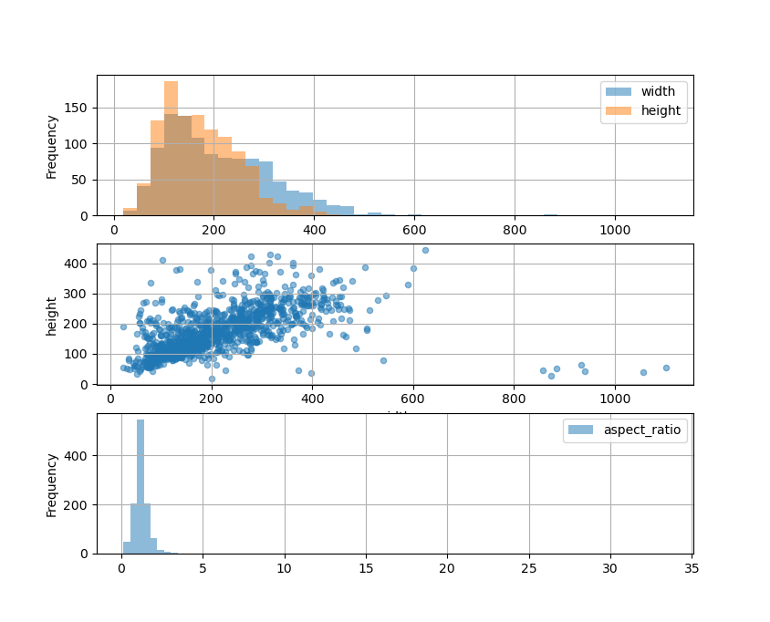
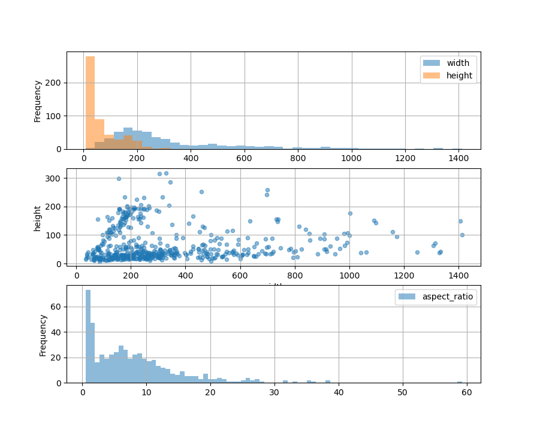
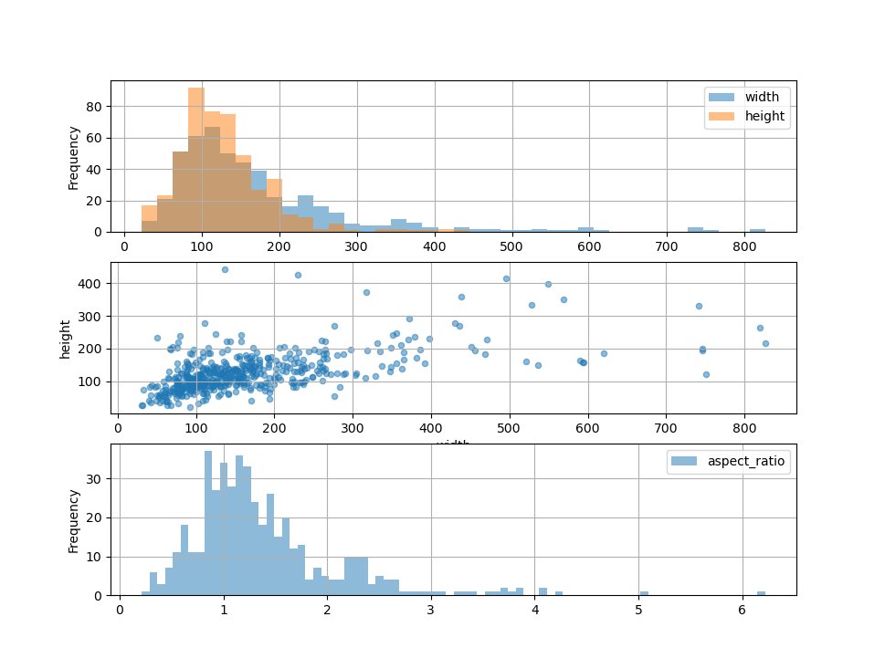
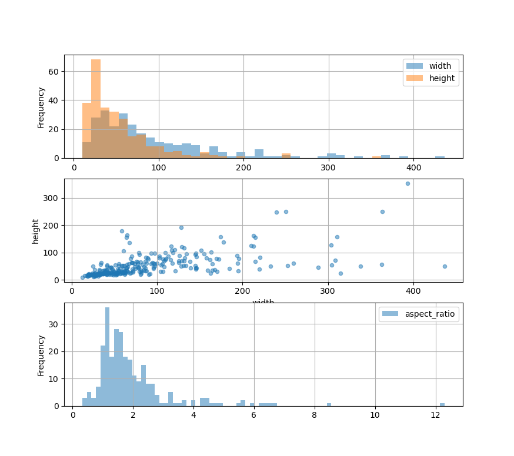

# Bounding boxes

Class 0:

|                                 | width              | height  |
|---------------------------------|--------------------|-------------|
| count                           | 1107.000000        | 1107.000000 |
| mean                            | 214.088292         | 173.195691  |
| std                             | 119.825792         | 74.613826   |
| min                             | 25.917636          | 19.483075   |
| 25%                             | 125.828597         | 113.724422  |
| 50%                             | 188.671358         | 163.748409  |
| 75%                             | 282.239609         | 222.329374  |
| max                             | 1100.844360        | 443.308176  |
| Aspect_ratio for class0:        | 1.3868855034842253 |             |
| Height within 3 std for class0: | 396.93604323319425 |             |
| Width within 3 std for class0:  | 573.40326524098'   |             |

Class 1:

|                                 | width              | height     |
|---------------------------------|--------------------|------------|
| count                           | 516.000000         | 516.000000 |
| mean                            | 329.790302         | 67.087434  |
| std                             | 258.936246         | 60.270929  |
| min                             | 34.285450          | 7.643785   |
| 25%                             | 162.324320         | 24.888902  |
| 50%                             | 237.062170         | 40.189239  |
| 75%                             | 446.480562         | 89.780199  |
| max                             | 1411.379883        | 317.569333 |
| Aspect_ratio for class1:        | 8.182171055956502  |            |
| Height within 3 std for class1: | 247.72493091563626 |            |
| Width within 3 std for class1:  | 1105.845954811264  |            |

Class 2:

|                                 | width              | height     |
|---------------------------------|--------------------|------------|
| count                           | 482.000000         | 482.000000 |
| mean                            | 171.676831         | 127.770596 |
| std                             | 121.524307         | 59.860112  |
| min                             | 30.830866          | 22.743220  |
| 25%                             | 96.926245          | 88.919894  |
| 50%                             | 137.286888         | 117.989965 |
| 75%                             | 201.923339         | 152.363782 |
| max                             | 826.649840         | 442.962185 |
| Aspect_ratio for class2:        | 1.3901404796824341 |            |
| Height within 3 std for class2: | 307.1645490540977  |            |
| Width within 3 std for class2:  | 535.871368205459   |            |

Class 3:

|                                 | width              | height     |
|---------------------------------|--------------------|------------|
| count                           | 271.000000         | 271.000000 |
| mean                            | 92.093924          | 53.175593  |
| std                             | 73.892702          | 43.874080  |
| min                             | 12.533406          | 10.107433  |
| 25%                             | 41.130286          | 24.307547  |
| 50%                             | 67.532596          | 39.415310  |
| 75%                             | 117.975204         | 64.604908  |
| max                             | 436.449597         | 352.605143 |
| Aspect_ratio for class3:        | 1.9561635383806273 |            |
| Height within 3 std for class3: | 184.55476360141125 |            |
| Width within 3 std for class3:  | 313.3626521679143  |            |